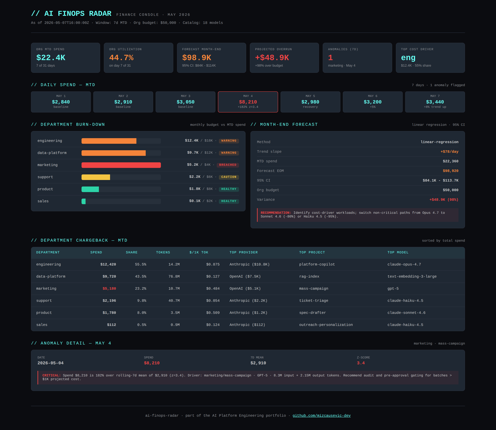

# AI FinOps Radar

[](https://github.com/mizcausevic-dev/ai-finops-radar/actions/workflows/ci.yml)
[](https://nodejs.org)
[](https://www.typescriptlang.org)
[](LICENSE)

FinOps governance layer for enterprise AI spend. Token-level cost attribution, multi-provider price comparison, budget burn-down with tiered alerts, daily anomaly detection, monthly forecasting with confidence intervals, and department chargeback rollups.

> Recruiter takeaway:
>
> *"This person built the FinOps tooling every CFO is asking the platform team for. Token-level attribution, anomaly detection, monthly forecasting, and chargeback — all as testable backend logic that can drop into a finance review."*

## Why This Exists

Most companies shipping AI in 2026 have the same blind spot: **finance can see total spend but not why it's happening.** The Anthropic invoice arrives at month-end and somebody on the platform team gets pulled into a meeting they can't prepare for. There's no chargeback model. No anomaly alerts. No forecast. No way to say "engineering's copilot drove 60% of spend, marketing's mass campaign on May 4 was a one-day anomaly, and we're on track to hit budget +12% if nothing changes."

This repo is that visibility layer. It treats AI spend like any other FinOps surface — pricing catalog, budget tracking, anomaly detection, forecasting, chargeback — except built for the LLM provider mix instead of cloud compute.

## Where This Sits in the Portfolio

| Repo | Surface | Question it answers |
|---|---|---|
| [`mcp-sentinel`](https://github.com/mizcausevic-dev/mcp-sentinel) | Tool calls | What MCP tools are exposed and how risky? |
| [`rag-sentinel`](https://github.com/mizcausevic-dev/rag-sentinel) | Retrieval | What's in the vector store and how trustworthy? |
| [`agent-codex`](https://github.com/mizcausevic-dev/agent-codex) | Decisions | Under what policies are decisions allowed? |
| [`agent-eval-arena`](https://github.com/mizcausevic-dev/agent-eval-arena) | Pre-prod | Should this model promotion ship? |
| [`agentobserve`](https://github.com/mizcausevic-dev/agentobserve) | Runtime | What did agents actually do? |
| [`shadow-ai-detector`](https://github.com/mizcausevic-dev/shadow-ai-detector) | Egress | Who's leaking what to whom? |
| [`kinetic-flightdeck`](https://github.com/mizcausevic-dev/kinetic-flightdeck) | Operator | Are we OK right now? |
| **`ai-finops-radar`** | **Finance** | ***Are we on budget — and why not?*** |

## Five Capabilities

### 1. Cost Calculator + Price Comparator

Pricing catalog covers ~18 models across Anthropic, OpenAI, Google, AWS Bedrock, Cohere, Mistral, and inference hosts (Together, Groq, Fireworks). Each entry tracks input rate, output rate, optional cached-input rate, capability tags, and context window.

Cost computation handles cached-input discounts (Anthropic-style prompt caching). Provider comparator returns ranked rows with `vsBaselinePct` so finance can see "switching this workload from Opus to Haiku saves 95%."

### 2. Budget Tracker

Per-budget evaluation returns: utilization %, days elapsed/remaining, burn rate, **projected month-end spend**, **projected overrun**, status band (`healthy` → `caution` → `warning` → `breached`), alert level, and a recommended action that names the dollar overrun.

Importantly, status combines both current utilization AND projected trajectory — so a department at 60% util on day 5 with a steep slope gets flagged as `caution` before it actually hits 75%.

### 3. Anomaly Detection

Rolling-window mean + stddev with z-score thresholds. Flags daily-grain spend outliers with severity (`info` / `warn` / `critical`) and rationale text. Configurable window size, z-score thresholds, and minimum absolute delta to suppress small fluctuations.

The output names what happened in dollars and percent — not just "anomaly detected."

### 4. Monthly Forecasting

Linear regression on day-of-month vs daily spend produces month-end forecast with **95% confidence interval** computed from residual standard deviation. Falls back to mean-based projection when fewer than 4 datapoints. The output includes the slope so a CFO can see "trend is +$340/day."

### 5. Department Chargeback

Rollup includes per-department: total spend, share of org spend, unique users/projects/providers, top provider/model/project (with dollar contribution), cost per 1k tokens. Sorted by spend so the biggest line items are first. This is the rollup that goes into a finance review packet.

## API Endpoints

### Cost

| Method | Endpoint | Purpose |
|---|---|---|
| POST | `/api/cost/compute` | Compute cost for tokens against a model |
| POST | `/api/cost/compare` | Multi-provider cost comparison for same workload |
| GET | `/api/cost/catalog` | Full pricing catalog |
| GET | `/api/cost/catalog/:modelId` | Single pricing entry |

### Budgets

| Method | Endpoint | Purpose |
|---|---|---|
| GET | `/api/budgets` | List demo budgets |
| POST | `/api/budgets/evaluate` | Evaluate a budget against spend + asOf date |

### Insights

| Method | Endpoint | Purpose |
|---|---|---|
| POST | `/api/insights/anomalies` | Detect anomalies in a daily-cost series |
| POST | `/api/insights/forecast` | Forecast month-end spend with CI |
| POST | `/api/insights/chargeback` | Department chargeback rollup |

### Dashboard

| Method | Endpoint | Purpose |
|---|---|---|
| GET | `/health` | Service status |
| GET | `/api/dashboard/summary` | Full FinOps summary across the demo dataset |

## Sample: Provider Comparison

```json
POST /api/cost/compare
{
  "inputTokens": 1000000,
  "outputTokens": 500000,
  "modelIds": ["claude-opus-4.7", "claude-sonnet-4.6", "claude-haiku-4.5", "gpt-5", "gemini-2.5-flash"]
}
```

```json
{
  "rows": [
    { "provider": "Google", "modelId": "gemini-2.5-flash", "displayName": "Gemini 2.5 Flash", "tier": "mainstream", "totalCostUsd": 1.55, "vsBaselinePct": 0 },
    { "provider": "Anthropic", "modelId": "claude-haiku-4.5", "displayName": "Claude Haiku 4.5", "tier": "small", "totalCostUsd": 2.80, "vsBaselinePct": 80.6 },
    { "provider": "Anthropic", "modelId": "claude-sonnet-4.6", "displayName": "Claude Sonnet 4.6", "tier": "mainstream", "totalCostUsd": 10.50, "vsBaselinePct": 577.4 },
    { "provider": "OpenAI", "modelId": "gpt-5", "displayName": "GPT-5", "tier": "frontier", "totalCostUsd": 36.00, "vsBaselinePct": 2222.6 },
    { "provider": "Anthropic", "modelId": "claude-opus-4.7", "displayName": "Claude Opus 4.7", "tier": "frontier", "totalCostUsd": 52.50, "vsBaselinePct": 3287.1 }
  ]
}
```

A 20× cost difference for the same workload is the kind of number that gets executives' attention.

## Operator Console Preview



## Getting Started

### Prerequisites

- Node.js 20+
- npm

### Setup

```bash
git clone https://github.com/mizcausevic-dev/ai-finops-radar.git
cd ai-finops-radar
npm install
npm run dev
```

Visit:

- `http://localhost:3000/health`
- `http://localhost:3000/api/dashboard/summary`
- `http://localhost:3000/api/cost/catalog`

### Run Tests

```bash
npm test
```

24 unit tests across cost calculation, provider comparison, budget evaluation, anomaly detection, forecasting, and chargeback rollup.

## What This Demonstrates

- FinOps thinking applied to AI spend (the topic every director-level role asks about)
- Pricing catalog research — covers cached-input discounts, embedding pricing, inference-host alternatives
- Statistical foundation — z-score anomaly detection, linear regression forecasting with proper CI
- Budget logic that combines current AND projected utilization (not just simple percentage)
- Department-level chargeback that drives down to top model + top project per dept
- Strict-mode TypeScript with full test coverage; CI matrix on Node 20 + 22

## Future Enhancements

- Pull live invoices from Anthropic / OpenAI / AWS Cost Explorer
- Multi-month historical baseline for seasonality-aware anomaly detection
- ARIMA / Prophet forecast comparison alongside linear baseline
- Budget alerts via Slack / PagerDuty webhook integration
- Org-level RBAC for chargeback access (engineering sees engineering only)
- Quarterly board-ready PDF export

## Tech Stack

- Node.js, TypeScript, Express, Zod
- Helmet, CORS, Morgan
- Node test runner

## Portfolio Links

- [LinkedIn](https://www.linkedin.com/in/mizcausevic/)
- [Skills Page](https://mizcausevic.com/skills)
- [Medium](https://medium.com/@mizcausevic)
- [GitHub](https://github.com/mizcausevic-dev)

Part of [mizcausevic-dev's GitHub portfolio](https://github.com/mizcausevic-dev) — AI Platform Engineering doctrine.

---

**Connect:** [LinkedIn](https://www.linkedin.com/in/mirzacausevic/) · [Kinetic Gain](https://kineticgain.com) · [Medium](https://medium.com/@mizcausevic/) · [Skills](https://mizcausevic.com/skills/)
