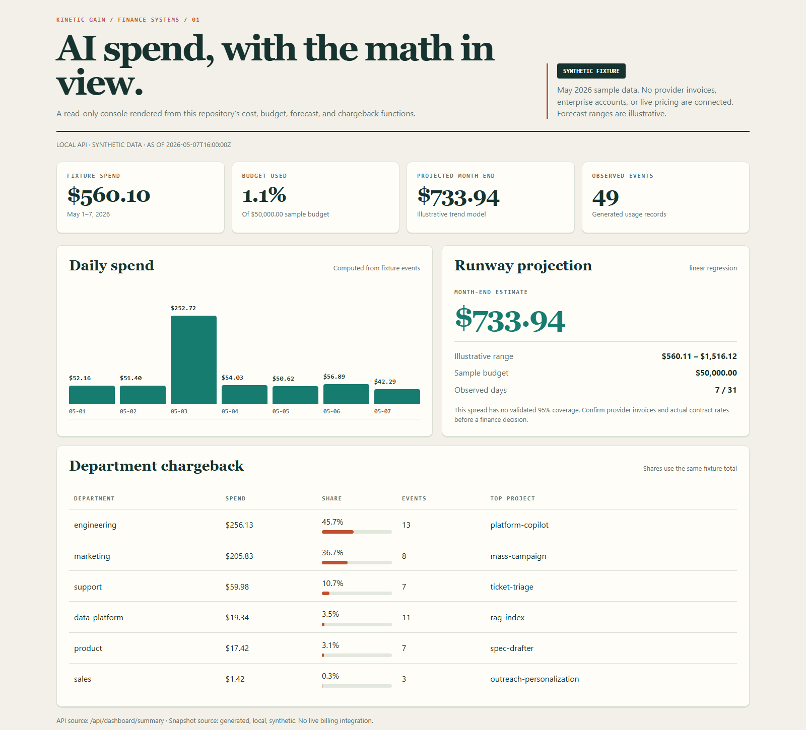

# AI FinOps Radar

[](https://github.com/mizcausevic-dev/ai-finops-radar/actions/workflows/ci.yml)
[](https://nodejs.org)
[](https://www.typescriptlang.org)
[](LICENSE)

Local FinOps logic demonstrator for AI usage. It computes sample token costs, budgets, anomaly signals, an illustrative month-end projection, and department chargeback from synthetic events.

> **Demo boundary:** No provider billing or invoice feed is connected. The 17-entry price catalog is illustrative and unverified for current provider rates or your contracts. The May 2026 usage records, departments, and budgets are synthetic. Forecast ranges are heuristic and have no validated statistical coverage. Do not use these outputs for invoices, purchasing, or production chargeback.

## Why This Exists

Finance teams need a way to connect model usage to budgets and cost drivers. This repository demonstrates the calculations with a fixed, inspectable fixture rather than claiming live invoice coverage.

The modules cover pricing inputs, budget tracking, anomaly detection, forecasting, and chargeback. An authenticated ingestion and reconciliation layer would be needed before operational use.

## Where This Sits in the Portfolio

| Repo | Surface | Question it answers |
|---|---|---|
| [`mcp-sentinel`](https://github.com/mizcausevic-dev/mcp-sentinel) | Tool calls | What MCP tools are exposed and how risky? |
| [`rag-sentinel`](https://github.com/mizcausevic-dev/rag-sentinel) | Retrieval | What's in the vector store and how trustworthy? |
| [`agent-codex`](https://github.com/mizcausevic-dev/agent-codex) | Decisions | Under what policies are decisions allowed? |
| [`agent-eval-arena`](https://github.com/mizcausevic-dev/agent-eval-arena) | Pre-prod | Should this model promotion ship? |
| [`agentobserve`](https://github.com/mizcausevic-dev/agentobserve) | Runtime | What did agents actually do? |
| [`shadow-ai-detector`](https://github.com/mizcausevic-dev/shadow-ai-detector) | Egress | Which sample destinations and patterns warrant review? |
| [`kinetic-flightdeck`](https://github.com/mizcausevic-dev/kinetic-flightdeck) | Operator | Are we OK right now? |
| **`ai-finops-radar`** | **Finance** | ***How do sample usage records compare with a sample budget?*** |

## Five Capabilities

### 1. Cost Calculator + Price Comparator

The illustrative catalog contains 17 entries across Anthropic, OpenAI, Google, AWS Bedrock, Cohere, Mistral, and inference hosts (Together, Groq, Fireworks). Each entry tracks input rate, output rate, optional cached-input rate, capability tags, and context window. Rates and model availability have not been verified for production use.

Cost computation handles cached-input discounts. The comparator returns ranked rows with `vsBaselinePct` for this sample catalog; workload quality and actual contract rates must be checked before a switch.

### 2. Budget Tracker

Per-budget evaluation returns: utilization %, days elapsed/remaining, burn rate, **projected month-end spend**, **projected overrun**, status band (`healthy` → `caution` → `warning` → `breached`), alert level, and a recommended action that names the dollar overrun.

Importantly, status combines both current utilization AND projected trajectory — so a department at 60% util on day 5 with a steep slope gets flagged as `caution` before it actually hits 75%.

### 3. Anomaly Detection

Rolling-window mean + stddev with z-score thresholds. Flags daily-grain spend outliers with severity (`info` / `warn` / `critical`) and rationale text. Configurable window size, z-score thresholds, and minimum absolute delta to suppress small fluctuations.

The output names what happened in dollars and percent — not just "anomaly detected."

### 4. Monthly Forecasting

Linear regression on daily spend produces a month-end estimate and an **illustrative range** derived from residual spread. The range is not a calibrated confidence or prediction interval. The series must include one entry for every UTC day from the month's first day through `asOf`, including explicit zero-spend days. Fewer than four observations use a mean-based projection.

### 5. Department Chargeback

Rollup includes per-department: total spend, share of org spend, unique users/projects/providers, top provider/model/project (with dollar contribution), cost per 1k tokens. Sorted by spend so the biggest sample line items are first. Reconcile real usage and invoices before using a rollup in a finance review packet.

## API Endpoints

### Cost

| Method | Endpoint | Purpose |
|---|---|---|
| POST | `/api/cost/compute` | Compute cost for tokens against a model |
| POST | `/api/cost/compare` | Multi-provider cost comparison for same workload |
| GET | `/api/cost/catalog` | Full pricing catalog |
| GET | `/api/cost/catalog/:modelId` | Single pricing entry |

### Budgets

| Method | Endpoint | Purpose |
|---|---|---|
| GET | `/api/budgets` | List demo budgets |
| POST | `/api/budgets/evaluate` | Evaluate a budget against spend + asOf date |

### Insights

| Method | Endpoint | Purpose |
|---|---|---|
| POST | `/api/insights/anomalies` | Detect anomalies in a daily-cost series |
| POST | `/api/insights/forecast` | Illustrative month-end projection and range |
| POST | `/api/insights/chargeback` | Department chargeback rollup |

Budget evaluation requires a first-of-month UTC date and an `asOf` UTC instant within that month. Chargeback windows accept real UTC calendar dates (inclusive days) or UTC instants; impossible dates and reversed windows return HTTP 400.

### Dashboard

| Method | Endpoint | Purpose |
|---|---|---|
| GET | `/health` | Service status |
| GET | `/api/dashboard/summary` | Full FinOps summary across the demo dataset |

## Sample: Provider Comparison

```json
POST /api/cost/compare
{
  "inputTokens": 1000000,
  "outputTokens": 500000,
  "modelIds": ["claude-opus-4.7", "claude-sonnet-4.6", "claude-haiku-4.5", "gpt-5", "gemini-2.5-flash"]
}
```

```json
{
  "rows": [
    { "provider": "Google", "modelId": "gemini-2.5-flash", "displayName": "Gemini 2.5 Flash", "tier": "mainstream", "totalCostUsd": 1.55, "vsBaselinePct": 0 },
    { "provider": "Anthropic", "modelId": "claude-haiku-4.5", "displayName": "Claude Haiku 4.5", "tier": "small", "totalCostUsd": 2.80, "vsBaselinePct": 80.6 },
    { "provider": "Anthropic", "modelId": "claude-sonnet-4.6", "displayName": "Claude Sonnet 4.6", "tier": "mainstream", "totalCostUsd": 10.50, "vsBaselinePct": 577.4 },
    { "provider": "OpenAI", "modelId": "gpt-5", "displayName": "GPT-5", "tier": "frontier", "totalCostUsd": 36.00, "vsBaselinePct": 2222.6 },
    { "provider": "Anthropic", "modelId": "claude-opus-4.7", "displayName": "Claude Opus 4.7", "tier": "frontier", "totalCostUsd": 52.50, "vsBaselinePct": 3287.1 }
  ]
}
```

These illustrative rates produce a wide spread for the same token counts; they do not compare model quality, availability, or contracted cost.

## Operator Console Preview



This is a Chrome capture of `/preview` against the running local API. The page fetches `/api/dashboard/summary`; it is not a mock graphic or evidence of live billing data. Recreate it with `npm run build`, `npm start`, then open `http://127.0.0.1:3000/preview`.

## Getting Started

### Prerequisites

- Node.js 20+
- npm

### Setup

```bash
git clone https://github.com/mizcausevic-dev/ai-finops-radar.git
cd ai-finops-radar
npm ci
npm run dev
```

Visit:

- `http://localhost:3000/health`
- `http://localhost:3000/api/dashboard/summary`
- `http://localhost:3000/api/cost/catalog`
- `http://127.0.0.1:3000/preview`

### Run Tests

```bash
npm test
```

The test suite covers cost calculation, provider comparison, budget evaluation, anomaly detection, forecasting, chargeback windows, API validation, and the preview route.

## What This Demonstrates

- FinOps thinking applied to AI spend (the topic every director-level role asks about)
- Sample pricing inputs that illustrate cached-input discounts, embedding pricing, and inference-host alternatives
- Reproducible heuristic analytics — z-score anomaly detection and linear regression with an explicitly uncalibrated range
- Budget logic that combines current AND projected utilization (not just simple percentage)
- Sample department rollup that identifies top model and project in the fixture
- Strict-mode TypeScript with CI on Node 20 + 22

## Production gates

The service binds to `127.0.0.1` and is a local demo. An external deployment would require authenticated tenant-scoped ingestion, invoice reconciliation, current provider and contract price provenance, access controls for employee and department data, request abuse controls, retention rules, and observability. No production deployment is configured or claimed.

The [permissioned reconciliation intake](docs/reconciliation-intake.md) specifies the minimum matching usage, billing, and rate evidence for a later local pilot. Those inputs are not available for this draft, so its calculations remain fixture-only.

## Future Enhancements

- Pull live invoices from Anthropic / OpenAI / AWS Cost Explorer
- Multi-month historical baseline for seasonality-aware anomaly detection
- ARIMA / Prophet forecast comparison alongside linear baseline
- Budget alerts via Slack / PagerDuty webhook integration
- Org-level RBAC for chargeback access (engineering sees engineering only)
- Quarterly board-ready PDF export

## Tech Stack

- Node.js, TypeScript, Express, Zod
- Helmet
- Node test runner

## Portfolio Links

- [LinkedIn](https://www.linkedin.com/in/mizcausevic/)
- [Skills Page](https://mizcausevic.com/skills)
- [Medium](https://medium.com/@mizcausevic)
- [GitHub](https://github.com/mizcausevic-dev)

Part of [mizcausevic-dev's GitHub portfolio](https://github.com/mizcausevic-dev) — AI Platform Engineering doctrine.

---

**Connect:** [LinkedIn](https://www.linkedin.com/in/mirzacausevic/) · [Kinetic Gain](https://kineticgain.com) · [Medium](https://medium.com/@mizcausevic/) · [Skills](https://mizcausevic.com/skills/)
